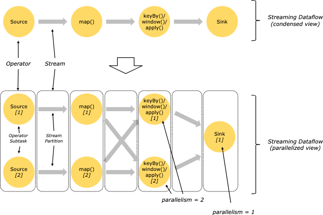
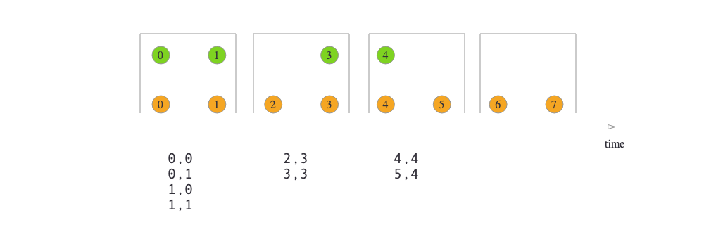

# DataStream API
## DataStream
`DataStream<>` is the core abstraction of Flink. It represents a stream of elements of the same type. It is a distributed collection of data elements that are processed in parallel. Transformations for DataStreams are acoomplished by creating new DataStream objects of the desired type.
### Stream Processing
How operators and stream processing works in Flink.


## Operators
Operators are the core building blocks of Flink programs. They are used to define the data transformations that are applied to the input data streams.
Operators transform one or more DataStreams into a new DataStream.

### Transformation
Transformation methods are defined as different DataStream methods, these include operations like `map`, `flatMap`, `filter`, etc. Creating transformations essentially orchestrates all the DataStreams.

Look at the following example:
```java
StreamExecutionEnvironment env = StreamExecutionEnvironment.getExecutionEnvironment();
DataStream<String> text = env.readTextFile("path/to/textfile");
DataStream<String> filtered = text.filter(new FilterFunction<String>() {
    public boolean filter(String value) {
        return value.startsWith("http");
    }
});
```
Then this is followd by a Sink method, which is the final method that is used to write the data to a file or a database. 

```java
filtered.writeAsText("path/to/outputfile");
env.execute("My Flink Job"); //This line starts the entire execution of the job. 
```

#### Keyed Streams
Keyed streams are streams that are partitioned by key. Keyed streams are used to group elements by key and perform operations on the grouped elements.
There are multiple ways to specify keys in Flink:
- By field position
- By field name
- By key selector function

An example of a key selector function is:
```java
DataStream<Tuple2<Long, String>> keyedStream = stream.keyBy(new KeySelector<Tuple2<Long, String>, Long>() {
    public Long getKey(Tuple2<Long, String> value) {
        return value.f0;
    }
});
```

### Windows
> Truncator of stream, by time/size. 

Windows split the stream into "buckets" of finite size, over which you can perform computations. Windows are defined by a window assigner, which groups elements into windows based on a certain characteristic. 
Keyed windows are different from non-keyed windows:
- Keyed windows are computed per key.
- Non-keyed windows are computed over all elements in the stream.

When using windows to a stream, you need to specify the window assigner. Triggers and evictors are optional. 

Example code for a keyed window:
```java
DataStream<Tuple2<Long, String>> stream = ...;
stream
    //keyBy() would not be needed for non-keyed windows
    .keyBy(0) 
   // window() would be replaced by windowALL() for non-keyed windows
    .window(TumblingEventTimeWindows.of(Time.seconds(5)))
    .reduce(new ReduceFunction<Tuple2<Long, String>>() {
        public Tuple2<Long, String> reduce(Tuple2<Long, String> value1, Tuple2<Long, String> value2) {
            return new Tuple2<>(value1.f0, value1.f1 + value2.f1);
        }
    });
```

`WindowAssigner` defines how elements are assigned to windows. There are different types of window assigners:
- TimeWindow: Assigns elements to windows based on timestamps.
- CountWindow: Assigns elements to windows based on the number of elements.
- SessionWindow: Assigns elements to windows based on gaps in timestamps.

In the code above, `TumblingEventTimeWindows` is splitting the stream into windows of 5 seconds.

### Joining Streams
Joining streams is a common operation in stream processing. It combines two or more streams that are in the same window based on a common key.
The creation of pairwise combinations behaves like an inner-join. 

There are three types of joins:
- Tumbling Window Join: Joins two streams based on a common key within a fixed window.
- Sliding Window Join: Joins two streams based on a common key within a sliding window.
- Session Window Join: Joins two streams based on a common key within a session window.

General syntax for joining streams:
```java
stream.join(otherStream)
    .where(<KeySelector>)
    .equalTo(<KeySelector>)
    .window(<WindowAssigner>)
    .apply(<JoinFunction>);
```

#### Tumbling Window Join

    
```java
import org.apache.flink.api.java.functions.KeySelector;
import org.apache.flink.streaming.api.windowing.assigners.TumblingEventTimeWindows;
import org.apache.flink.streaming.api.windowing.time.Time;
 
...

DataStream<Integer> orangeStream = ...;
DataStream<Integer> greenStream = ...;

orangeStream.join(greenStream)
    .where(<KeySelector>)
    .equalTo(<KeySelector>)
    .window(TumblingEventTimeWindows.of(Time.milliseconds(2)))
    .apply (new JoinFunction<Integer, Integer, String> (){
        @Override
        public String join(Integer first, Integer second) {
            return first + "," + second;
        }
    });
```


### ProcessFunction
> Just a customized stream operator.

`ProcessFunction` is a low-level stream processing **operation** that gives access to the internal state and timers of the function. It is used to implement custom stateful stream processing logic.

It is defined as: a function that processes elements of a stream. 
ProcessFunction has some main methods:
- `processElement()`: This method is called for each element in the input stream. It can output zero or more elements to one or more output streams.
- `onTimer()`: This method is called when a registered timer fires.
- It also inherits from the `RichFunction` interface, which provides methods for initialization and cleanup.

For every element in the input stream, the `processElement()` method is called. This method can output zero or more elements to one or more output streams. 

## State
`State` object stores the state of the computation. It needs to be defined in the `open()` method, it's just a configuration object that specifies the type of state and its default value, and it will be managed by the Flink runtime. 

There are two types of states:
- Operator State: This state is maintained by the operator and is not part of the user-defined function.
- Keyed State: This state is maintained by the user-defined function and is associated with a key.
#### Operator State
Each parallel instance of the operator maintains its own copy of the state. The state is not shared between parallel instances. In a typical stateful operation, you don't need operators state. It is mostly a special type of state that is used in source/sink implementations and scenarios where you don't have a key by which state can be partitioned. 

#### Keyed State
Possible types of keyed state are:
- ValueState: stores a single value
- ListState: stores a list of values
- MapState: stores a map of key-value pairs
- ReducingState: stores a single value that is the result of reducing all the values that are added to the state

Application: counting the number of events per key. 

```java
public class EventCountFunction extends KeyedProcessFunction<Tuple2<Long, String>, Tuple2<Long, String>, String> {
    private transient ValueState<Integer> eventCountState;

    @Override
    public void open(Configuration parameters) throws Exception {
        ValueStateDescriptor<Integer> descriptor = new ValueStateDescriptor<>(
            "eventCount", // State name
            Integer.class, // Type of state
            0); // Default value of the state
        eventCountState = getRuntimeContext().getState(descriptor);
    }

    @Override
    public void processElement(
            Tuple2<Long, String> value,
            Context ctx,
            Collector<String> out) throws Exception {
        // Update the state
        int currentCount = eventCountState.value();
        currentCount++;
        eventCountState.update(currentCount);

        // Emit the result as a formatted string
        out.collect("User ID: " + value.f0 + ", Event Type: " + value.f1 + ", Count: " + currentCount);
    }
}

```