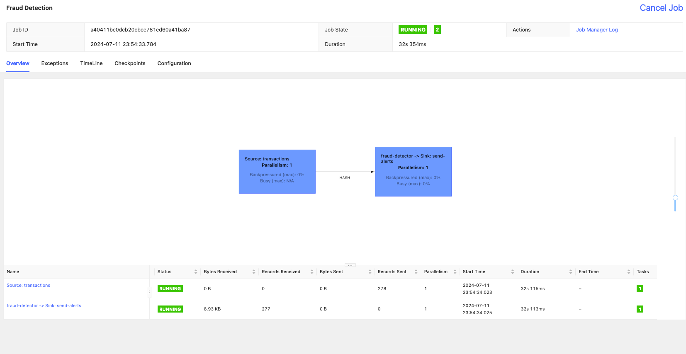

# Quick Start Guide to Flink
See detailed documentation: [Flink Setup process for MacOS](https://nightlies.apache.org/flink/flink-cdc-docs-master/docs/deployment/standalone/#:~:text=Flink%20runs%20on%20all%20UNIX,and%20Cygwin%20(for%20Windows))

## Flink Setup process for MacOS
> Always see official documentation for the most up-to-date information.
1. Download the binary file
2. navigate to the directory of the binary file and extract
3. Set the environment variable of `FLINK_HOME` to the directory of the extracted file
4. Start the Flink cluster by running
    ```bash
    cd $FLINK_HOME
    ./bin/start-cluster.sh
    ```

To verify the status of the cluster, navigate to `http://localhost:8081/` in your browser or run
```bash
$ ps aux | grep flink
```

To stop the cluster, run
```bash
$ ./bin/stop-cluster.sh
```

## Run program
1. After starting Flink cluster, run the following command in `frauddetection` folder to run the program
```bash
mvn clean package
```
`clean` removes the `target` directory and `package` compiles the program and creates a jar file in the `target` directory. `package` phase includes the `compile` phase in the [Maven lifecycle](https://maven.apache.org/guides/introduction/introduction-to-the-lifecycle.html).

3. Test to see if the program compiled successfully
```bash
mvn exec:java
```

4. Go to `$FLINK_HOME` and run the following command to run the program
```bash
./bin/flink run -c spendreport.FraudDetection target/flink-fraud-detection-0.1.jar
```
This submits the jar file to the Flink cluster and runs the program.

## Flink Dashboard UI
The following image shows the Flink UI while running the program the program. The Web UI is accessible at `http://localhost:8081/`.

