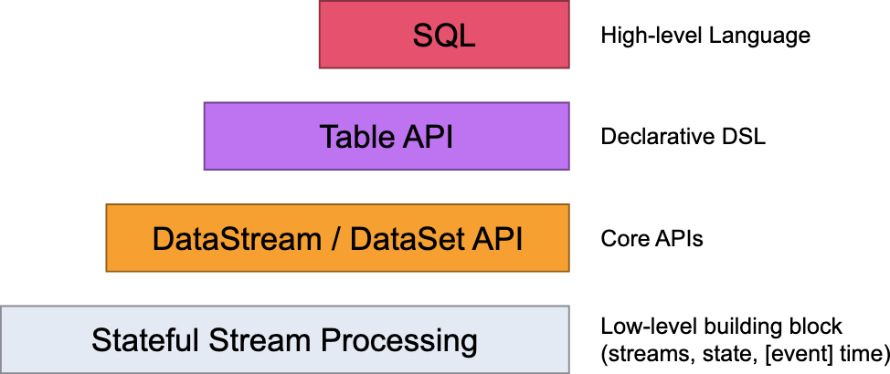
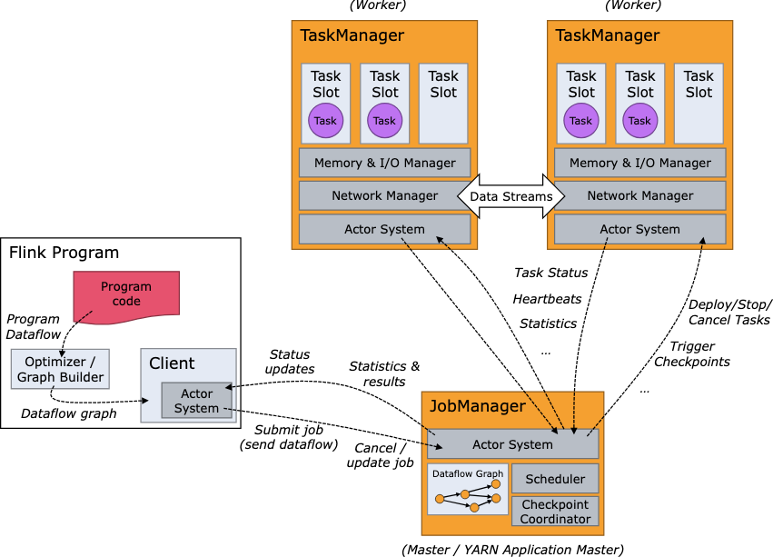

# Concepts
Apache Flink is used for processing large amounts of data in a distributed manner. It is a powerful tool for processing data in real-time and batch processing. The following are some of the key concepts in Apache Flink.
Advantage is that it supports stream processing, batch processing is an add on. 

This framework allows you to define computational methods used for processing while maintaining the distributed manner.

Data can be sourced through two ways, either by batch or by stream like Kafka, in type DataStream<string>.

## Levels of Abstraction

- [**DataStream API**](./DataStreamAPI.md): This is the core API for processing. DataSet API is the older version of the DataStream API, used for batch processing.
- **Table API**: Declarative DSL( Domain Specific Language) for processing data.
- **SQL API**: SQL queries can be used to process data.

## Architecture
Flink is a distributed system and requires effective allocation and management of compute resources in order to execute streaming applications.

## Anatomy of a Flink Program
A Flink program consists of the following components:
- Environment: The environment is the entry point for creating Flink programs. It is used to set up the execution environment and configure the program.
- DataStream: DataStreams are the core abstraction of Flink. They represent a stream of elements of the same type.
- Operators: Operators are used to define the data transformations that are applied to the input data streams.
- Transformation: Transformation methods are defined as different DataStream methods, these include operations like `map`, `flatMap`, `filter`, etc.
- Sink: Sink methods are used to write the data to a file or a database.
- Execution: The execution of the Flink program is started by calling the `execute()` method on the environment.

Each program consists of the same basic steps:
1. Create an execution environment.
2. Define input data.(Load or create the input data source)
3. Apply transformations.(Define the computation that should be performed on the data)
4. Define a sink.(Specify where the output should go)
5. Execute the program.